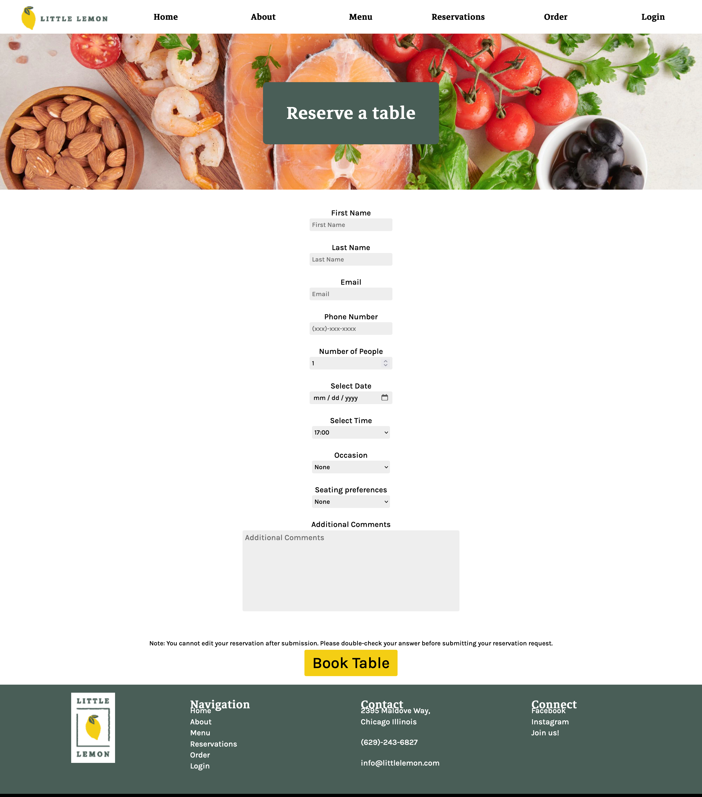

# Little Lemon Restaurant

Final capstone project for Meta Front-end developer program on Coursera, which contains a detailed and responsive website with table-booking functionality built using React.

### Install, Test and Run:

- Use 'npm run auto' on the root dir of project, it will performs tests and then it will start the application.

## Screenshot

### Home Page

### Booking Page

### Tech Stack:

- HTML, CSS
- JSX
- React

### Third Party Libraries & APIs:

- react-router-dom
- react-responsive-carousel
- Meta front-end table-booking API

### Author

- [Bilal Amjad](https://github.com/thedevelop3r)
